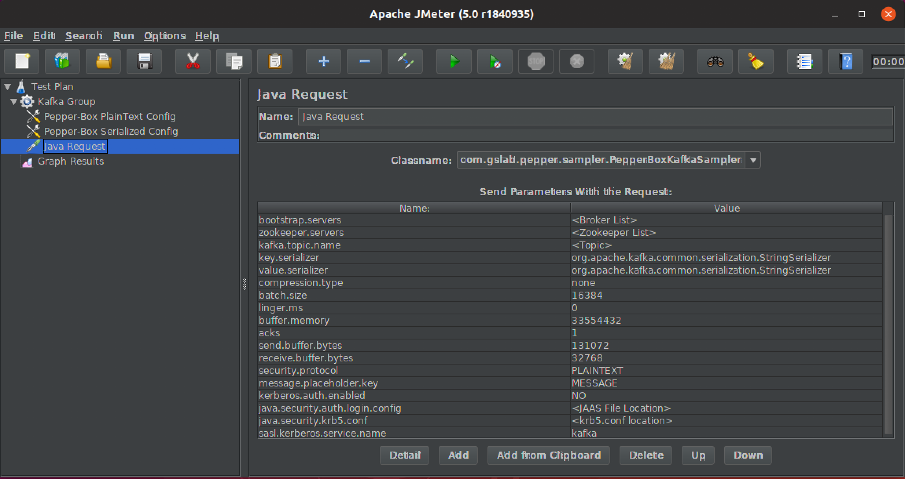
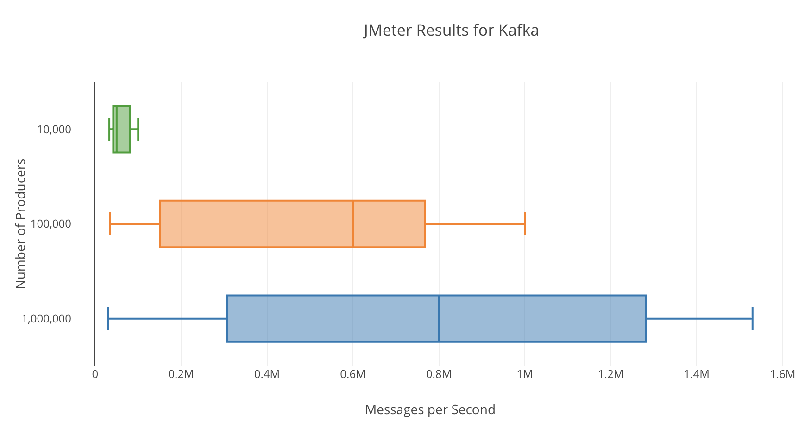

# Implementation Details

## Configuring The Producer - Pepper-Box
 
To install the plugin, you need to compile [this source code ](https://github.com/GSLabDev/pepper-box/releases)or [download the jar file](https://github.com/raladev/load), then put it in the lib/ext folder and restart JMeter.
 
This plugin has 3 elements:
* Pepper-Box PlainText Config allows building text messages according to a specified template.
* Pepper-Box Serialized Config allows building a message that is a serialized java object.
* PepperBoxKafkaSampler is designed to send the messages that were built by previous elements.
 
Let us look at each of them.

### Pepper-Box PlainText Config
 
To add this item, go to the 
`Thread group` -> `Add` -> `Config Element` -> `Pepper-Box PlainText Config`

As you can see in the picture above, the element has 2 fields:
* Message Placeholder Key - a key that will need to be specified in the PepperBoxKafkaSampler to use the template from this element.
* Schema Template - a message template in which you can use JMeter variables and functions, and also plugin functions. The structure of the message can be anything, from plain text, to JSON or XML.
 
For example, in the screenshot above, we are passing the JSON string as a message, using several plugin functions: to specify the message number, to specify the identifier and the sending timestamp.

As you can see in the picture above, the element has a field for the key and the Class Name field, which is intended for specifying the Java class. The jar file with the class must be placed in the `lib/ext folder`. After it is specified, the fields with its properties will appear below, and you can assign desired values to them. We repeated the message from the last element, but it will be a Java object this time.

### PepperBoxKafkaSampler
 
To add this element, go to 
`Thread group` -> `Add`-> `Sampler` -> `Java Request`. Then, select `com.gslab.pepper.sampler.PepperBoxKafkaSampler` from the drop-down list

* This element has the following settings:
	* *bootstrap.servers/zookeeper.servers* - the addresses of brokers/zookeepers (a zookeeper is an interface that distributes the load from the producers between different brokers) in the format of broker-ip-1: port, broker-ip-2: port, etc.
	* **kafka.topic.name**- is the name of the topic for message publication.
	* **key.serializer** - is a class for key serialization. Leave it unchanged if there is no key in the message.
	* **value.serializer** - is a class for message serialization. For a simple text, the field remains unchanged. When using Pepper-Box Serialized Config, you need to specify "com.gslab.pepper.input.serialized.ObjectSerializer".
	* **compression.type** - is a type of message compression (none/gzip/snappy/lz4)
	* **batch.size** - is the largest message size.
	* **linger.ms** - is the message waiting time.
	* **buffer.memory** - is the producer's buffer size.
	* **acks** - is the quality of service (-1/0/1 - delivery is not guaranteed/the message will surely be delivered/the message will be delivered once).
	* **receive.buffer.bytes/send.buffer.bytes** - the size of the TCP send/receive buffer. -1 - use the default OS value.
	* **security.protocol** - is the encryption protocol (PLAINTEXT/SSL/SASL_PLAINTEXT/ SASL_SSL).
	* **message.placeholder.key** - is the message key, which was specified in the previous elements.
	* **kerberos.auth.enabled, java.security.auth.login.config, java.security.krb5.conf, sasl.kerberos.service.name** - are a field group responsible for the authentication.
 
### Results
